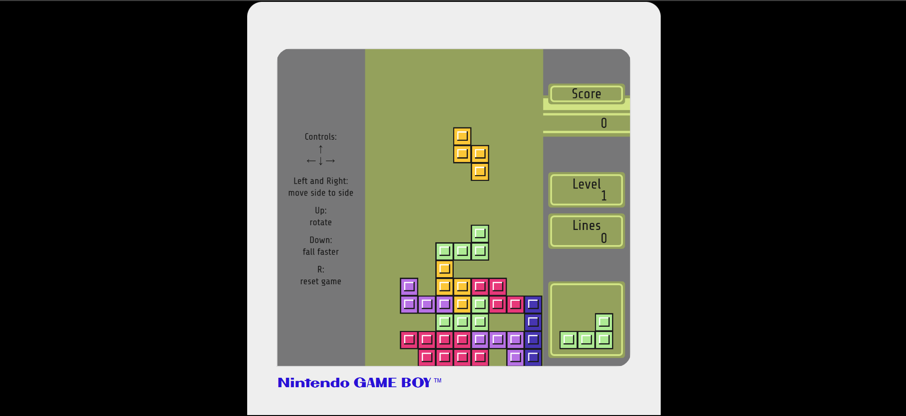

# 🎮 Tetris Game Clone

A mini Tetris game built in JavaScript, inspired by the classic **Nintendo Game Boy™** design.



## 📦 About the Project

It’s built using:
- 🧠 **JavaScript** (with the p5.js library for drawing)
- 🎨 **HTML & CSS** (with a custom retro font)
- 🎮 A layout inspired by the NINTENDO Game Boy shell

## 📁 Main Files

- `index.html` – Basic structure of the game, includes scripts and fonts
- `style.css` – Styles for the interface and Game Boy screen
- `script.js` – Game logic (score, pieces, collisions, etc.)
- `pieces.js` – Shape and rotation logic for the Tetris pieces

## 🚀 How to Run Locally

1. Clone this repository:
   ```bash
   git clone https://github.com/USERNAME/REPO-NAME.git

## 🕹️ Controls
- ⬅️ / ➡️ – Move piece left / right
- ⬇️ – Accelerate the falling piece
- R - Reset Game

## 📸 Inspired By
- The original Nintendo Game Boy™
- This project is inspired by [Day #73 - Gameboy Tetris Clone](https://github.com/AsmrProg-YT/100-days-of-javascript/tree/master/Day%20%2373%20-%20Gameboy%20Tetris%20Clone) from the [100 Days of JavaScript](https://github.com/AsmrProg-YT/100-days-of-javascript) series.